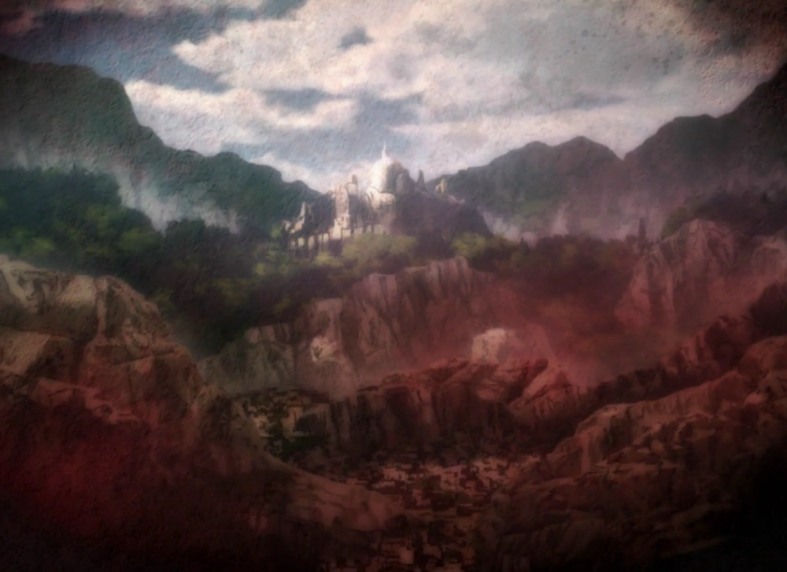

# Diamond

## **L’Empire aux Mille Cicatrices**

Le Royaume de Diamond fut jadis une puissance redoutable, forgée par la discipline et l’acier. Ici, il n’y avait pas de place pour la faiblesse, seule la force permettait de survivre. Contrairement aux autres royaumes, où la noblesse et les lignées magiques faisaient la loi, Diamond s’était bâti sur un principe simple : l’évolution par la souffrance et la guerre.

Les dirigeants du royaume avaient érigé un système impitoyable, où chaque individu était façonné dès l’enfance pour devenir un combattant d’exception. Les plus prometteurs étaient soumis à des expériences visant à transcender les limites du corps humain, mêlant alchimie et magie interdite. Mais ces ambitions eurent des conséquences désastreuses. En cherchant à créer des guerriers parfaits, ils donnèrent naissance à une génération de soldats qui, privés de libre arbitre, finirent par se retourner contre leurs créateurs.

Le jour où la Tour Noire s’effondra, symbole du pouvoir absolu de Diamond, le royaume bascula dans le chaos. Ce qui avait été une forteresse imprenable devint un champ de ruines, où ne subsistait plus que l’instinct de survie. Aujourd’hui, les terres autrefois florissantes ne sont plus qu’un territoire morcelé, livré à des luttes incessantes entre ceux qui veulent restaurer la gloire passée et ceux qui cherchent à imposer un nouveau modèle.

### **Les Grandes Factions**

* <mark style="color:purple;">**La Légion de l’Adamant**</mark> : Fidèles aux idéaux du royaume déchu, ils souhaitent rétablir l’ordre d’antan et reprendre le contrôle des technologies perdues, quitte à employer les mêmes méthodes brutales que par le passé.
* <mark style="color:orange;">**Les prodiges du futur:**</mark> Nés des expériences interdites, ces parias du système refusent de se soumettre à une autorité quelconque. Ils prônent la destruction totale de l’ancien monde et l’avènement d’une nouvelle ère où la force seule dicterait les lois.
* <mark style="color:red;">**Les Alchimistes de Cobalt :**</mark> Savants et occultistes, ils poursuivent les recherches abandonnées, convaincus que le futur appartient à ceux qui maîtriseront la fusion entre chair et magie. Leurs expérimentations frôlent l’inhumain, mais ils considèrent cela comme le prix du progrès.

### **Le Futur en Suspens**

Diamond est au bord du gouffre. Certains voient en lui un empire à relever, d’autres un cadavre à enterrer. Une chose est sûre : les décisions prises aujourd’hui façonneront l’histoire de demain.

<figure><figcaption></figcaption></figure>
