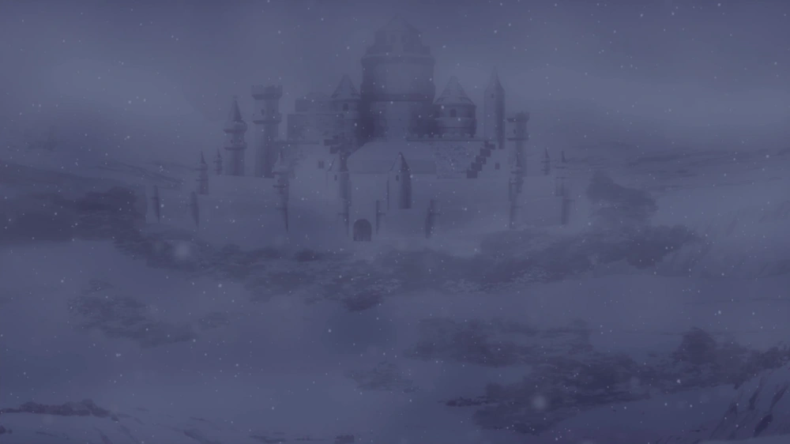

# Spade

## **Une Histoire Tragique**

Le Royaume de Spade, jadis dominé par une dynastie cruelle, fut marqué par des siècles de peur et d’oppression. Ses dirigeants, liés à des forces obscures, maintenaient leur pouvoir par la terreur et la magie interdite. Mais un soulèvement brisa leurs chaînes, mettant fin à leur règne. La chute du trône ne signifia cependant pas la fin des conflits. Au contraire, un nouveau combat débuta : celui de la reconstruction.

L’effondrement de l’ordre ancien laissa un vide béant. Plusieurs factions émergèrent, chacune déterminée à façonner Spade selon sa propre vision. Les nobles, refusant de perdre leur influence, tentèrent de restaurer une monarchie sous un nouveau nom. Pendant ce temps, des pauvres civiles rêvaient d’un monde où le peuple déciderait de son propre destin. Mais dans l’ombre, certains cherchaient à raviver les pactes démoniaques, persuadés que la grandeur du royaume ne pouvait être restaurée que par le pouvoir absolu, certains ne pensaient qu'à la déstruction et à la force pure..

Aujourd’hui, le royaume est un échiquier où chaque pièce cherche à prendre l’avantage. Entre alliances éphémères et trahisons, tous poursuivent un but commun : assurer la suprématie de leur vision et monter Spade au plus haut. Certains prônent l’usage de la magie pure, d’autres se fient à la force brute, tandis que quelques esprits plus téméraires explorent les chemins interdits de la magie démoniaque.

### **Les Grandes Factions**

* <mark style="color:purple;">**Le Cercle d’Azur :**</mark> Composé d’anciennes familles nobles, ce groupe aspire à la stabilité et au retour d’une monarchie forte. Ils détiennent une armée disciplinée et des mages dévoués aux traditions.
* <mark style="color:orange;">**Les Héritiers de l’Aube :**</mark> Révolutionnaires déterminés à instaurer un gouvernement basé sur l’égalité, ils oscillent entre diplomatie et soulèvements armés pour imposer leur vision.
* <mark style="color:red;">**Les Fils du Néant :**</mark> Dévoués aux arts interdits, ils croient en la fusion de l’homme et du démon pour créer une nouvelle race supérieure. Ils œuvrent dans l’ombre pour retrouver les anciens pactes démoniaques.
* <mark style="color:yellow;">**Les Voyageurs du Givre :**</mark> Indépendants et libres, ils refusent de s’attacher à une cause. Ils explorent les vestiges du passé à la recherche de la vérité et de secrets oubliés.

### **Une Destinée à Forger**

Chaque mage du royaume doit choisir son camp. L’avenir de Spade repose entre les mains de ceux qui ont le courage d’écrire son destin. Sera-t-il reconstruit sur des bases nouvelles, ou sombrera-t-il à nouveau dans les ténèbres ?

L’histoire est en marche… et le monde attend ceux qui oseront la façonner.

<figure><figcaption></figcaption></figure>
